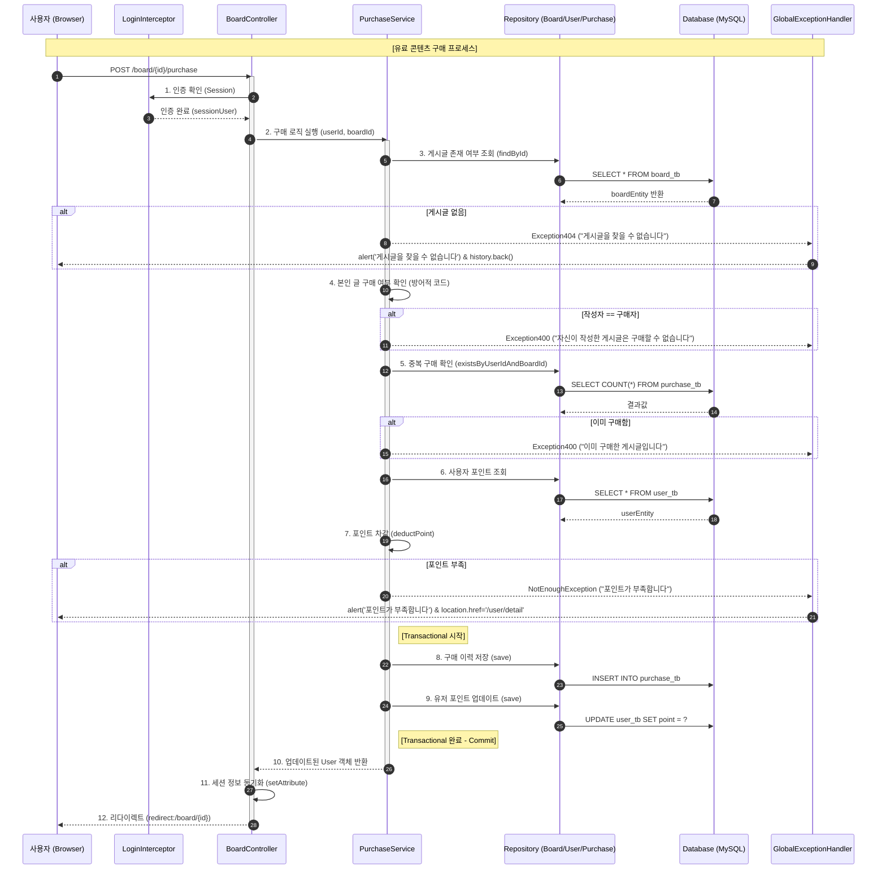

# 🚀 Premium Content & Point Billing Platform (Spring Blog Ver.3) [cite: 757]

[cite_start]본 프로젝트는 단순한 블로그 기능을 넘어, **PortOne PG API를 활용한 실제 결제 프로세스**와 **포인트 기반의 유료 콘텐츠 소비 아키텍처**를 구축한 웹 애플리케이션입니다. [cite: 757]

 

## [cite_start]1. 🛠 핵심 비즈니스 로직 상세 (Core Logic) [cite: 758]

### [cite_start]① 포인트 충전 및 위변조 방지 검증 [cite: 758]
* [cite_start]**사전 결제 요청 (Prepare):** 결제창을 띄우기 전, 서버에서 고유한 `paymentId`를 생성하여 발급합니다. [cite: 758] [cite_start]이는 주문 번호의 중복을 막고, 서버가 인지하지 못한 결제 요청을 차단하기 위함입니다. [cite: 759]
* [cite_start]**서버 간 검증 (Server-to-Server):** 결제 완료 후, 클라이언트가 보낸 금액 정보를 그대로 믿지 않고 포트원 API를 통해 실제 결제된 금액을 재조회하여 검증합니다. [cite: 760]

### [cite_start]② 유료 콘텐츠 구매 및 차감 로직 [cite: 761]
* [cite_start]**복합 권한 검증:** 유료 게시글 조회 시 `작성자 본인 여부`, `기존 구매 이력`, `보유 포인트 잔액`을 순차적으로 확인합니다. [cite: 761]
* [cite_start]**원자성 보장:** `PurchaseService`에서 포인트 차감과 구매 내역 저장을 하나의 `@Transactional`로 묶어, 어느 하나라도 실패할 경우 전체 로직을 롤백하여 데이터 무결성을 유지합니다. [cite: 762]

 

## [cite_start]2. 💡 기술적 문제 해결 (Troubleshooting) [cite: 763]

### [cite_start]① OSIV 비활성화를 통한 커넥션 효율화 [cite: 763]
* [cite_start]**Problem:** OSIV(Open Session In View)가 활성화되어 있으면 API 응답이 끝날 때까지 DB 커넥션을 점유하여 대규모 트래픽 발생 시 커넥션 고갈 위험이 있었습니다. [cite: 763]
* [cite_start]**Solution:** `application.yml`에서 OSIV를 `false`로 설정하고, 필요한 데이터는 서비스 레이어에서 **DTO로 변환**하여 반환함으로써 트랜잭션 종료 즉시 커넥션을 반환하도록 설계했습니다. [cite: 764]

### [cite_start]② N+1 문제 해결 및 Fetch Join 최적화 [cite: 765]
* [cite_start]**Problem:** OSIV 비활성화 후 View에서 연관된 엔티티(User, Board 등)에 접근할 때 `LazyInitializationException`이 발생했습니다. [cite: 765]
* [cite_start]**Solution:** `JpaRepository`에서 `JOIN FETCH`를 사용하여 연관된 데이터를 한 번의 쿼리로 조회하도록 최적화했습니다. [cite: 766]

 

## [cite_start]3. 🏗 아키텍처 및 보안 설계 (Architecture & Security) [cite: 767]

### [cite_start]① 계층형 아키텍처 (3-Tier) [cite: 768]
* [cite_start]**Controller - Service - Repository - Entity** 구조를 철저히 분리하여 유지보수성을 높였으며, 엔티티 보호를 위해 모든 데이터 전송에 **DTO**를 사용했습니다. [cite: 768]

### [cite_start]② 인터셉터 기반의 다단계 보안 [cite: 769]
* [cite_start]**LoginInterceptor:** 인증이 필요한 모든 경로(`/board/**`, `/user/**` 등)를 보호합니다. [cite: 769]
* [cite_start]**AdminInterceptor:** 관리자 권한(`ADMIN`) 확인 로직을 분리하여 관리자 전용 대시보드의 보안을 강화했습니다. [cite: 770]
* [cite_start]**SessionInterceptor:** 화면에 필요한 공통 유저 정보를 `postHandle` 시점에 주입하여 컨트롤러 중복 코드를 제거했습니다. [cite: 771]

 

## [cite_start]4. 📺 주요 화면 가이드 (UI/UX) [cite: 772]
* [cite_start]**유료 콘텐츠 상세보기:** 구매 전에는 콘텐츠가 가려지며, 보유 포인트와 대조하여 '구매하기' 버튼이 동적으로 노출됩니다. [cite: 772]
* [cite_start]**포인트 충전 페이지:** 포트원 브라우저 SDK를 활용하여 사용자에게 익숙한 PG 결제창을 제공하고, 다양한 금액 선택 버튼을 배치했습니다. [cite: 773]
* [cite_start]**마이 프로필:** 현재 보유 포인트와 프로필 이미지 업로드 상태를 한눈에 확인할 수 있습니다. [cite: 774]

 

## [cite_start]5. 📊 핵심 워크플로우 분석 (Deep Dive) [cite: 775]

[cite_start]**메일 인증 및 회원가입 신뢰성 확보** [cite: 775]
1. [cite_start]**인증번호 발송:** `MailUtil`로 생성한 6자리 난수를 세션에 이메일 계정별로 저장합니다. [cite: 775]
2. [cite_start]**인증 도장 부여:** 인증 성공 시 세션에 `verified_email`이라는 '도장'을 찍어둡니다. [cite: 776]
3. [cite_start]**최종 가입 검증:** 가입 요청 시 세션의 인증 정보와 요청 이메일이 일치하는지 재확인하여 이메일 위변조 가입을 원천 차단합니다. [cite: 777]

 

## [cite_start]6. 🛠 DB 스키마 설계 (Entity Relationship) [cite: 778]

[cite_start]데이터의 무결성과 효율적인 조회를 위해 정규화된 테이블 구조를 설계했습니다. [cite: 781] [cite_start]특히, 구매 이력과 사용자 권한은 별도 테이블로 분리하여 확장성을 확보했습니다. [cite: 781]

| 테이블명 | 역할 및 특징 | 핵심 설정 |
| :--- | :--- | :--- |
| **user_tb** | [cite_start]사용자 기본 정보 및 포인트 관리 [cite: 781] [cite_start]| email, username 유니크 제약 조건 [cite: 781] |
| **board_tb** | [cite_start]게시글 데이터 및 유료 여부 관리 [cite: 781] [cite_start]| premium 컬럼(Boolean)으로 유료 글 구분 [cite: 781] |
| **purchase_tb** | [cite_start][핵심] 사용자별 게시글 구매 이력 [cite: 781] [cite_start]| uk_user_board (User+Board) 복합 유니크 제약 조건으로 중복 구매 방지 [cite: 781] |
| **payment_tb** | [cite_start]외부 PG사(포트원)를 통한 실제 포인트 충전 내역 [cite: 781] [cite_start]| paymentId 유니크 설정으로 결제 데이터 정합성 보장 [cite: 781] |
| **user_role_tb** | [cite_start]사용자의 권한(ADMIN, USER) 관리 [cite: 781] | [cite_start]CascadeType.ALL 설정으로 User와 생명주기 동기화 [cite: 781] |
| **reply_tb** | [cite_start]게시글별 댓글 데이터 관리 [cite: 781] | [cite_start]게시글 삭제 시 관련 댓글 일괄 삭제(Modifying 쿼리) [cite: 781, 782] |

 

## [cite_start]7. 🔒 보안 및 편의 기능 (Security & Utils) [cite: 783]

[cite_start]기술적인 안정성 외에도 실제 운영 환경을 고려한 보안 및 편의 기능을 배치했습니다. [cite: 783]
* [cite_start]**비밀번호 보안:** `BCryptPasswordEncoder`를 사용하여 사용자 비밀번호를 단방향 해시 암호화하여 저장합니다. [cite: 783]
* **이메일 위변조 방지:** 회원가입 시 세션에 저장된 인증 이메일(`verified_email`)과 실제 가입 요청 이메일을 대조하여 비정상적인 가입 시도를 원천 차단합니다. [cite: 783]
* [cite_start]**날짜 포맷팅 유틸:** `MyDateUtil`을 사용하여 Timestamp 데이터를 `yyyy-MM-dd HH:mm` 형식으로 변환, 모든 뷰 레이어에서 일관된 날짜 형식을 제공합니다. [cite: 783]

[cite_start]단순한 성공 흐름뿐만 아니라, 코드에 구현된 **방어적 로직(Exception Handling)**과 데이터 정합성 보장 과정을 포함하여 설계 역량을 강조했습니다. [cite: 784]

 

## [cite_start]8. 📊 유료 콘텐츠 구매 상세 시퀀스 다이어그램 [cite: 785]

### [cite_start]💡 시퀀스 다이어그램 핵심 포인트 설명 [cite: 791]
* **트랜잭션의 원자성 (Atomicity):** 유료 콘텐츠 구매 시 **'포인트 차감'**과 **'구매 이력 생성'**은 반드시 동시에 성공하거나 실패해야 합니다. [cite: 792] `@Transactional` 어노테이션을 사용하여 두 작업 중 하나라도 실패할 경우 전체 로직이 롤백되도록 설계하여 데이터 정합성을 보장했습니다. [cite: 792]
* [cite_start]**5단계 방어적 코드 (Defensive Programming):** 게시글 존재 확인, 본인 글 구매 차단, 중복 구매 확인, 사용자 유효성 확인, 잔액 검증 등 총 5단계의 철저한 검증을 거칩니다. [cite: 792, 793]
* [cite_start]**전역 예외 처리 체계 (Global Error Handling):** 서비스에서 발생한 다양한 예외는 `GlobalExceptionHandler`에서 가로채어 사용자에게 명확한 메시지를 전달하고 적절한 페이지로 유도하도록 구현했습니다. [cite: 793]
